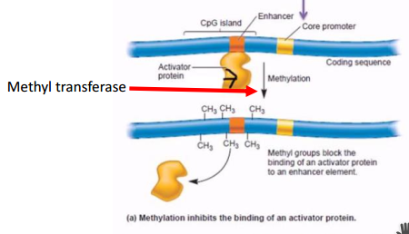
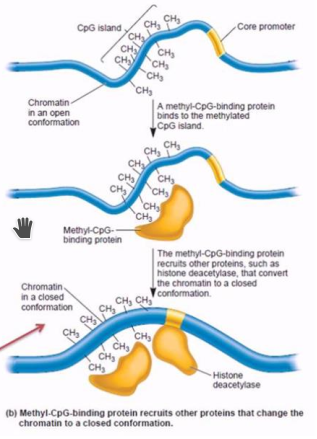
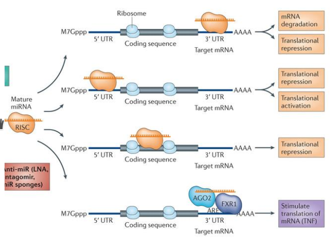
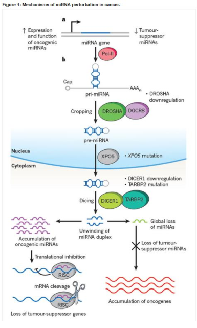
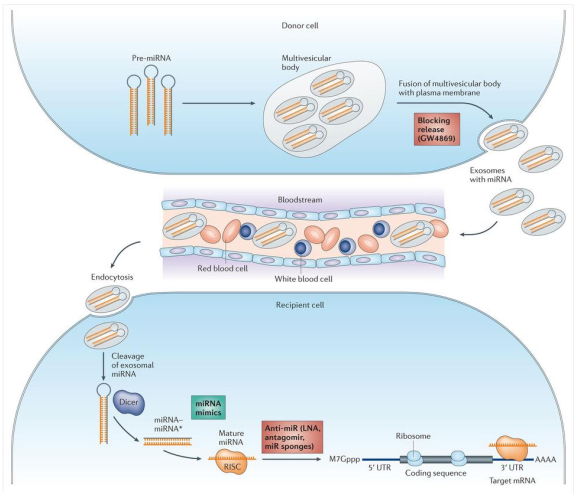

# Analytical Genomic Notes

## Table of Contents
|       Section        |
| -----------------    |
|   [W10](#w10) |
|   [W11](#w11) |

## W10
### DNA Methylation and CpG Island
- CG island is a short stretch of DNA in which the frequency of the CG sequence is higher than other regions
    - also called the CpG island, where "p" simply indicates that "C" and "G" are connected by a phosphodiester bond
- CG sequences in inactive genes are usually methylated to supress their expression
- methylation plays crutial role in gene regulation
    - when located in a gene promoter, typically acts to repress gene transcription

        1. Methylation of CpG islands may prevent or enhance binding of regulatory transcription factors to promoter region

        

        2. Inhibition using methyl-CpG-binding proteins, which bind methylated sequences

        
- methylated cytosine may be converted to thymine by accidental deamination
    - unlike C->U mutation which is efficiently repaired, C->T can only be fixed by inefficient mismatch repair
- methylation and acetylation can either activate or repress specific histones

### microRNA

- what is microRNA
    - small non-coding RNA molecule (containing about 22 nucleotides) found in plants, animals and some viruses
    - encode regulatory RNA molecules that are not translated (not including rRNA, tRNA, snRNA, etc)
    - 1000s identifed in various genomes
    - 1000 or more in human genom`e
    - regulate mRNA stability, translation, and participate in cell communication
- miRNA function (summary)
    - function in RNA silencing and post-transcriptional regulation of gene expression
- first 7 or 8 nucleotide pairs determine which target it binds to

#### miRNA Mechanism/Function

- function pathways
    - miRNA binds 3’-UTR - mRNA destabilization
    - miRNA binds coding region – translational repression
    - miRNA binds 5’-UTR – translational repression/activation
- translational regulation
    - not always degraded, sometimes stores the target and released later for a delayed translation
- dysregulation of miRNA genes contributes to cancer in some cases - possibly all
    - due to loss of tumour-supressor miRNAs
    

#### miRNA Execretion
- secreted in exosome - cell-cell communication
- secreted as free molecule +/- proteins - cell-cell communication
- miRNA released by cell death
- liquid biopsies
    - trying to detect miRNA from exosomes trying to use blood tests to determine state of tumours in blood
    - RNA-Seq (or PCR) for circulating miRNAs
    

#### Finding miRNA Targets
- gene knockout (KO) + transcriptional profile & phenotype
- gene overexpression + transcriptional profile & phenotype
- validation
    - validate results for mRNA by measuring protein levels/turnover
- TargetScan
    - summarizes data and predicts targets
    - predicts biological targets of microRNAs (miRNAs) by searching for the presence of sites that match the seed region of each miRNA

## W11

### Left Over Bits
- more odd bits
- correlates of complexity: orthologues, introns-exons, domain architecture
- FACS (fluorescence activated cell sorting_ and Mass cytometry
- metabolomics
    - detecting and quantifying molecules

### Protein Interaction Networks
- How many proteins per gene?
    - factors:
        - alternative splicing - isoforms
        - limited proteolysis
        - editing
        - covalent modification
            - phosphorylation Ser Thr Tyr His
            - methylation, adenylation
            - myristylation, palmitoylation, GPI-linked
            - glycosylation
            - ubiquitinylation, sumoylation etc.
    - Proteome estimated as high as 10-100x gene number (or more) if defined as all of the individual forms of proteins in cell

- How do we separate and detect proteins?
    - SDS gel electrophoresis
    - Immunoblotting
    need specific reagents e.g. antibodies
    - Mass spectrometry
        - ID proteins by mass of fragments, identify protein if you
        know its sequence
        - Does not require specific reagents
        - Able to identify covalent modified residues -- shift in mass

- protein modifications
    - Any of the covalent modifications could promote, inhibit or be neutral with respect to protein interaction. When testing for interaction, any of them could affect whether or not a response is identified.
    - A typical high throughput experiment showing a proteinprotein interaction is usually confirmed by at least two independent means, for example two hybrid analysis and coimmunoprecipitation (usually used in validation).
    - In co-immunoprecipitation, one protein is immunoprecipitated with a specific antibody and then interacting proteins are detected by western blotting of the precipitate. It assumes that such interacting proteins were interacting in the cell prior to cell breakage.

- protein-protein interaction assessment
    - Protein-protein interaction is also assessed by a variety of copurification, gradient centrifugation, native gel, gel overlay and column chromatography methods. These are the stock and trade of traditional biochemistry.
    - Obviously retaining protein interactions during such procedures is dependent on the local environment i.e. buffer, ions, etc. Under specific conditions the proteins interact.
    - The stringency of those conditions, just as in nucleic acid hybridization, dictates which molecular associations remain intact and therefore can be assayed.

- genomics
    - Focuses on large scale analysis of interactions
    - genome wide functional assay of proteins
        - dealing with individual proteins or devise strategies for making and assaying them at large scale
    - techniques:
        - two hybrid analysis
            - Monitor protein-protein interaction by expressing the two proteins within a cell and designing a reporter system to indicate whether they interact or not.
            - To confirm results from analyses such as two hybrid, typically a researcher would employ coIP or other affinity methods. This often requires however that a specific reagent be available to identify the proteins in western blots.
        - affinity methods coupled with mass spectrometry for identification
            - Various levels of separation purification prior to analysis.
        - affinity methods using stable isotope labelling of control and test sample
            - pooled samples for differential analysis

### Protein Structure
- utility of such bioinformatic programs greatly enhanced by growth in size of 3D structure databases such as PDB and MMDB
- some genomics research programs in structural bio set out to cyrstallize and determine the sequence of new gene products, especially unknown function or sequence orphans in hope of discovering function and/or new folds

- prediction of protein function ex. Swiss Model
    - instead of making prediction directly from primary sequence, some programs start by running BLAST search adn then model unknownagainst a highly similar protein for which the crystal cordinate are already known and present in PDB
    - works if it's beleived that primary sequence dictates structure and highly similar sequences (orthologues) maintain sequence similarity because they're structurally related

- Swiss Model
    - start with BLAST search to find orthologues (templates)
    - models primary sequence onto the coordinates of a similar protein with known structure

## Review
- profiles
    - for members of single families
- pams or blossoms
    - average of many populations
- e-values
