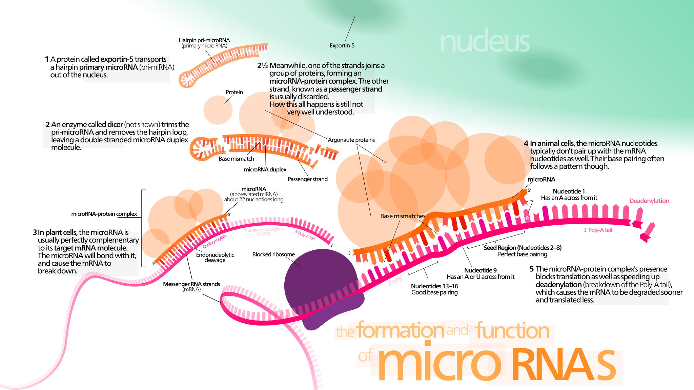

# Analytical Genomic Notes

## Table of Contents
|       Section        |
| -----------------    |
|   [W6](#w6) - Phenomics |
|   [W7](#w7) - Genetic Markers, GWAS, SNPs |
|   [W10](#w10) - Methylation and miRNA       |
|   [W11](#w11) - Protein-Protein Interactions|
|   [W12](#w12) - Summary & Synthetic Lethality|

## W6
### Phenomics + General Info
- assigning function to genes
    - observation -> inference -> experiment
- Yeast Gene deletion experiment
    - http://www-sequence.stanford.edu/group/yeast_deletion_project/deletions3.html
- forward vs reverse genetics
    - forward (phenotype -> sequence)
        - have phenotype
        - doing experiment to figure out the underlying causal sequence (the genetics)
    - reverse (sequence -> phenotype effect)
        - know sequence (often pertubation/mutation/variant in population)
        - doing experiments to figure out phenotype

## W7
### Genetic Markers, GWAS
- clustering of 770 000  genomes reveals post-colonial population structure of N/A
- microsatellite
    - di-, tri-, tetra-nucleotide repeats
    - length of these microsatellites might be cause of huntington's disease
- sex specific markers
    - nuclear DNA is inherite from all ancestors
    - mitochondrial DNA is inherited from a single lineage
- single nucleotide polymophism
    - single bp that varies across population
    - smallest possible allele
- genome wide association study (GWAS)
    - study: identifies novel risk loci for type 2 diabetes
    - finds likage but not necessarily the gene or the specific mutation
    - much validation is needed to turn a potential hit into a discovery
    - there still reamins the problem of reducing it to mechanism and ultimately treatment
- CNV (Copy Number Variants)
    - regions with a duplication in the DNA or a deletion
    - can be identified by quantitative array hybridization assays or by whole genome sequencing

## W10
### DNA Methylation and CpG Island
- CG island is a short stretch of DNA in which the frequency of the CG sequence is higher than other regions
    - also called the CpG island, where "p" simply indicates that "C" and "G" are connected by a phosphodiester bond
- CG sequences in inactive genes are usually methylated to supress their expression
- methylation plays crutial role in gene regulation
    - when located in a gene promoter, typically acts to repress gene transcription

        1. Methylation of CpG islands may prevent or enhance binding of regulatory transcription factors to promoter region

        

        2. Inhibition using methyl-CpG-binding proteins, which bind methylated sequences

        
- methylated cytosine may be converted to thymine by accidental deamination
    - unlike C->U mutation which is efficiently repaired, C->T can only be fixed by inefficient mismatch repair
- methylation and acetylation can either activate or repress specific histones

### microRNA

- what is microRNA
    - small non-coding RNA molecule (containing about 22 nucleotides) found in plants, animals and some viruses
    - encode regulatory RNA molecules that are not translated (not including rRNA, tRNA, snRNA, etc)
    - 1000s identifed in various genomes
    - 1000 or more in human genom`e
    - regulate mRNA stability, translation, and participate in cell communication
- miRNA function (summary)
    - function in RNA silencing and post-transcriptional regulation of gene expression
- first 7 or 8 nucleotide pairs determine which target it binds to

#### miRNA Mechanism/Function

- function pathways
    - miRNA binds 3’-UTR - mRNA destabilization
    - miRNA binds coding region – translational repression
    - miRNA binds 5’-UTR – translational repression/activation
- translational regulation
    - not always degraded, sometimes stores the target and released later for a delayed translation
- dysregulation of miRNA genes contributes to cancer in some cases - possibly all
    - due to loss of tumour-supressor miRNAs
    

#### miRNA Execretion
- secreted in exosome - cell-cell communication
- secreted as free molecule +/- proteins - cell-cell communication
- miRNA released by cell death
- liquid biopsies
    - trying to detect miRNA from exosomes trying to use blood tests to determine state of tumours in blood
    - RNA-Seq (or PCR) for circulating miRNAs
    

#### Finding miRNA Targets
- gene knockout (KO) + transcriptional profile & phenotype
- gene overexpression + transcriptional profile & phenotype
- validation
    - validate results for mRNA by measuring protein levels/turnover
- TargetScan
    - summarizes data and predicts targets
    - predicts biological targets of microRNAs (miRNAs) by searching for the presence of sites that match the seed region of each miRNA

### Chimp-Human Genetic Relationship
- sequence b/w humans and chimps are >96-99% identical
- our closest relative
- chimp-human difference is 1.06% (1:100 or so)
- 29% of all chimp protein sequence are identical to human
- most endogenous retrovirus insertion in humans now extinct
    - but chimp has two new active retroviral elements
- rates of evolution - which genes makes us different
    - synonomous mutations - those that do not cause an amino acid change (K_S) --> broadly neutral 
        - in humans there is negative selection against them in a large percentage of human ORFs
    - nonsynonymous substitution is a nucleotide mutation that alters the amino acid sequence of a protein (K_A)
        - genes under positive selection can be identified by number of non-synonomous mutations relative to synonomous ones
            - if there are more K_A mutations relative to K_S then gene is under positive selection
    - K_A (non-synon) / K_S (synon) = measure of selection
- selection measure values
    - K_A / K_S << 1 = large number of mutations have been eliminated through purifying selection
    - K_A / K_S > 1 = implies adaptive or positive selection
    - mean K_A per gene is 2
    - mean K_S per gene is 3
    - K_A/K_S for human-chimp is 0.23
        - implies that 77% of amino acid changes are sufficiently deleterious so as to be eliminated

- how are we different (possible clues)
    - HAR1F - microRNA involved in early cerebral cortex development is rapidly changing in humans

## W11

### Left Over Bits
- correlates of complexity: orthologues, introns-exons, domain architecture
- FACS (fluorescence activated cell sorting_ and Mass cytometry
- metabolomics
    - detecting and quantifying molecules
- domain accretion leads to more complex domain architectures
- domain architecture is conserved in orthologues
    - ex. more domain architecture is conserved in human&fly than in worm&fly

### Protein Interaction Networks
- How many proteins per gene?
    - factors:
        - alternative splicing - isoforms
        - limited proteolysis
        - editing
        - covalent modification
            - phosphorylation Ser Thr Tyr His
            - methylation, adenylation
            - myristylation, palmitoylation, GPI-linked
            - glycosylation
            - ubiquitinylation, sumoylation etc.
    - Proteome estimated as high as 10-100x gene number (or more) if defined as all of the individual forms of proteins in cell

- How do we separate and detect proteins?
    - SDS gel electrophoresis
    - Immunoblotting
    need specific reagents e.g. antibodies
    - Mass spectrometry
        - ID proteins by mass of fragments, identify protein if you
        know its sequence
        - Does not require specific reagents
        - Able to identify covalent modified residues -- shift in mass

- protein modifications
    - Any of the covalent modifications could promote, inhibit or be neutral with respect to protein interaction. When testing for interaction, any of them could affect whether or not a response is identified.
    - A typical high throughput experiment showing a proteinprotein interaction is usually confirmed by at least two independent means, for example two hybrid analysis and coimmunoprecipitation (usually used in validation).
    - In co-immunoprecipitation, one protein is immunoprecipitated with a specific antibody and then interacting proteins are detected by western blotting of the precipitate. It assumes that such interacting proteins were interacting in the cell prior to cell breakage.

- protein-protein interaction assessment
    - Protein-protein interaction is also assessed by a variety of copurification, gradient centrifugation, native gel, gel overlay and column chromatography methods. These are the stock and trade of traditional biochemistry.
    - Obviously retaining protein interactions during such procedures is dependent on the local environment i.e. buffer, ions, etc. Under specific conditions the proteins interact.
    - The stringency of those conditions, just as in nucleic acid hybridization, dictates which molecular associations remain intact and therefore can be assayed.

- genomics
    - Focuses on large scale analysis of interactions
    - genome wide functional assay of proteins
        - dealing with individual proteins or devise strategies for making and assaying them at large scale
    - techniques:
        - two hybrid analysis
            - Monitor protein-protein interaction by expressing the two proteins within a cell and designing a reporter system to indicate whether they interact or not.
            - To confirm results from analyses such as two hybrid, typically a researcher would employ coIP or other affinity methods. This often requires however that a specific reagent be available to identify the proteins in western blots.
        - affinity methods coupled with mass spectrometry for identification
            - Various levels of separation purification prior to analysis.
            - mass spectrometers allow for automated genomics based strategies for identification of unknown proteins based on mass
                - measures mass of molecule based on charge and time of flight in magnetic field
                    - often molecule is fragmented first, ex. by trypsin digestion
            - methods for affinity tagging proteins
                - affinity tagging bait
                    - column to bind tagged bait and associated proteins in complex
                    - SDS gel to separate proteins
                    - trypsin digest and mass spectrometer
                    - saturation of screen: new protein IDs decline with number of purifications
                - chemical labelling for differential protein expression analysis - ex. iTRAQ
                    - take samples
                    - protein extraction and enzyme digestion
                    - iTRAQ labelling
                    - mix samples
                    - HPLC separation of protein mixtures
                    - MALDI MS/MS analysis
                        - iTRAQ reporter icons
                        - MS/MS fragmentation
        - affinity methods using stable isotope labelling of control and test sample - ex. SILAC
            - pooled samples for differential analysis
            - SILAC ex.
                - take two groups
                    - cell grown in light isotope containing media
                    - cells grown in heavy isotope containing media + treatment
                - harvest cells
                - mix cell lysates (the products of lysis of cells)
                - create excise bands
                - trypsin digestions
                - LC-MS/MS and determining the ratios between light and heavy fragments

### Protein Structure
- utility of such bioinformatic programs greatly enhanced by growth in size of 3D structure databases such as PDB and MMDB
- some genomics research programs in structural bio set out to cyrstallize and determine the sequence of new gene products, especially unknown function or sequence orphans in hope of discovering function and/or new folds

- prediction of protein function ex. Swiss Model
    - instead of making prediction directly from primary sequence, some programs start by running BLAST search adn then model unknownagainst a highly similar protein for which the crystal cordinate are already known and present in PDB
    - works if it's beleived that primary sequence dictates structure and highly similar sequences (orthologues) maintain sequence similarity because they're structurally related

- Swiss Model
    - start with BLAST search to find orthologues (templates)
    - models primary sequence onto the coordinates of a similar protein with known structure

## W12

### Summary

- Bioinformatics
    - Theory and practice
    - alignment and evolutionary interpretation to 3D models
        - Databases and database searching
        - Scoring alignments
        - Similarity, homology, gaps
        - Substitution matrices
        - Local and global (and models of protein   - structure)
        - Optimal and heuristic
        - Multiple alignments
        - E-value and inference of homology
        - Conserved domains
        - Patterns and profiles
        - CDD and CDART
        - Domain architecture

- Genomics
    - Technology and sequence
        - NCBI and UCSC
        - UCSC browser
        - BLAST and BLAT
        - TRACKS on UCSC browser
        - Sequence manipulation (tutorial stuff)
        - correlation and clustering
    - Gene identification, expression, phenomics
        - identification:
            - General knowledge of sequencing - strategies
            - Whole genome sequencing
            - Genetic content
            - Evolutionary constraint 26 mammals and - comparative genomics track
            - Individual variation HapMap and 1000 - genomes
            - Comparative genomics
                - human, chimp, mouse, Drosophila, Caenorhabditis, E. coli
            - Gene numbers and genome sizes
            - mRNA and ESTs
            - Protein coding genes
            - miRNA’s
            - lincRNA’s
            - rRNA, tRNA, snRNA etc
            - SNPs, CNVs, indels
            - Orthologues and paralogues
        - expression:
            - Primary transcripts
            - Alternative start sites
            - Alternative splicing
            - Isoforms
            - Microarrays
            - RNA-seq
            - ChIP-seq
            - Encode and Fantom5
            - Transcription factors, promoters - and enhancers
            - lincRNA
            - Long range interaction

- Functional genomics
    - Regulation
        - phenomics
        - gene deletion
        - siRNA and knockdowns
        - Crispr
        - SNPs
        - GWAS

- Genes, gene products, interactions and networks
    - two hybrid, coimmunoprecipitation
    - affinity tags
    - mass spectrometry
    - binary and co-complex
    - random and scale free networks
    - synthetic lethality
    - FACS and mass cytometry

- Prospects, issues and ethics
 

### Sanna Masud Lecture
- synthetic lethality genetic screen applied to human embryonic stem cells
- 

## Review
- profiles
    - for members of single families
- pams or blossoms
    - average of many populations
- e-value: random expection
